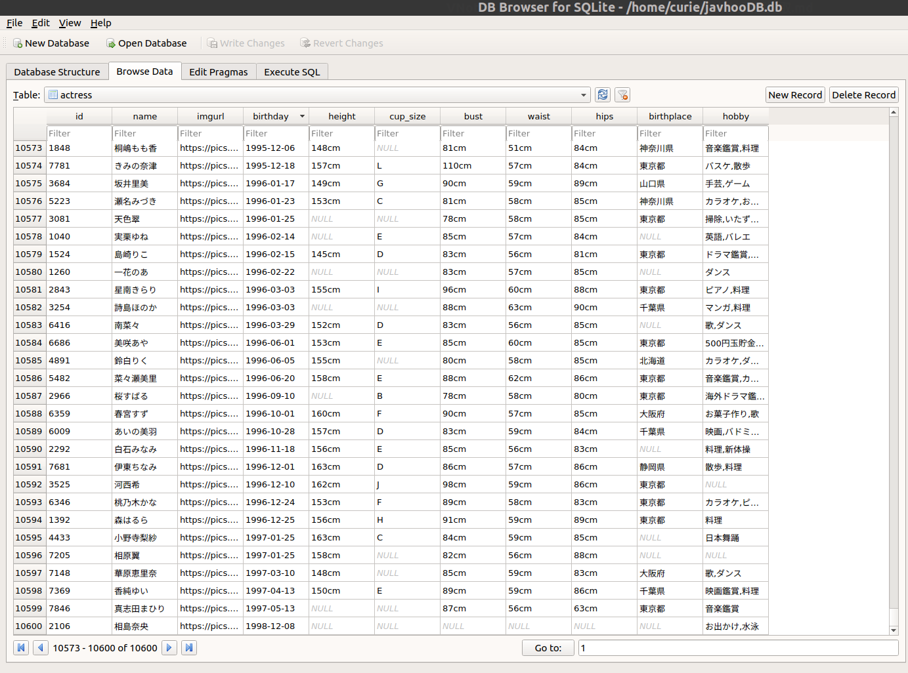

# javhoo_actresses


## What's javhoo_actresses used for?
In order to collect infomation about japanese Pornstars and analyse them, I started this project. [Javhoo.com](https://www.javhoo.com/) contains data that interests me, `javhoo_actresses` will extract data from downloaded HTML files, and save them to sqlite DB.

## Update!
- Kaggle Dataset:[japanese-pornstars-and-adult-videos](https://www.kaggle.com/twopothead/japanese-pornstars-and-adult-videos) you can publish a new kernel!
- Add metadata of Japanese Censored,Uncensored and VR porn videos in javhoo_actresses/db/javhooDB.db.

## How to use
First, you need to  fetch html pages from [javhoo.com/actresses](https://www.javhoo.com/actresses) using [cURL](https://curl.haxx.se/). Currently, there are 212 pages about Japanse Pornstars on  [Javhoo.com](https://www.javhoo.com/). Therefore, you need to download 212 pages.You can paste this command to your bash shell.
```sh
curl https://www.javhoo.com/actresses/page/[1-212] > javhoo_actresses_212pages.html
```
OK, now you have this file `javhoo_actresses_212pages.html`, then you need to modify configurations in `javhoo_actresses.py`. javhooDB.db is where you restore data from extracted html pages. In the beginning, it should contains nothing. 
```python
jactress_dict ={
'html_path':'/path/to/your/javhoo_actresses_212pages.html',
'sqlite3db_path':'/path/to/your/javhooDB.db'
}
```

After that, you can run this python script.
```
python javhoo_actresses.py
```
Here is the result. 

